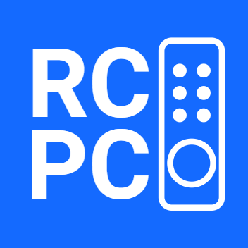

<!--
*** Thanks for checking out the Best-README-Template. If you have a suggestion
*** that would make this better, please fork the repo and create a pull request
*** or simply open an issue with the tag "enhancement".
*** Don't forget to give the project a star!
*** Thanks again! Now go create something AMAZING! :D
-->

<!-- PROJECT SHIELDS -->
<!--
*** I'm using markdown "reference style" links for readability.
*** Reference links are enclosed in brackets [ ] instead of parentheses ( ).
*** See the bottom of this document for the declaration of the reference variables
*** for contributors-url, forks-url, etc. This is an optional, concise syntax you may use.
*** https://www.markdownguide.org/basic-syntax/#reference-style-links
-->
[![Contributors][contributors-shield]][contributors-url]
[![Forks][forks-shield]][forks-url]
[![Stargazers][stars-shield]][stars-url]
[![Issues][issues-shield]][issues-url]
[![GPL v3.0 License][license-shield]][license-url]

<!-- PROJECT LOGO -->
 

  

<h3 align="center">RCPC Server - Windows</h3>

  

    This project is part of RCPC, for more information see <a href="https://github.com/konradrej/RCPC">here</a>
     
     
    <a href="https://github.com/konradrej/RCPC-Server-Windows/issues">Report Bug</a>
    ·
    <a href="https://github.com/konradrej/RCPC-Server-Windows/issues">Request Feature</a>
  

<!-- TABLE OF CONTENTS -->

  
Table of Contents

  <ol>
    <li><a href="#about-the-project">About The Project</a></li>
    <li>
      <a href="#getting-started">Getting Started</a>
      <ul>
        <li><a href="#prerequisites">Prerequisites</a></li>
        <li><a href="#installation">Installation</a></li>
      </ul>
    </li>
    <li><a href="#usage">Usage</a></li>
    <li><a href="#roadmap">Roadmap</a></li>
    <li><a href="#contributing">Contributing</a></li>
    <li><a href="#license">License</a></li>
    <li><a href="#contact">Contact</a></li>
    <li><a href="#acknowledgments">Acknowledgments</a></li>
  </ol>

<!-- ABOUT THE PROJECT -->
## About The Project

This projects aims to provide a fully compatible RCPC server for windows. It supports saving client devices for auto connecting in the future and provides full support for touchpad and mediakeys views.

(<a href="#top">back to top</a>)

<!-- GETTING STARTED -->
## Getting Started

### Prerequisites 
- Java (JRE)

### Installation

1. Download the latest jar from <a href="https://github.com/konradrej/RCPC-Server-Windows/releases">here.</a>
2. Double click it to run.

(<a href="#top">back to top</a>)

<!-- USAGE EXAMPLES -->
## Usage

For usage instructions please see <a href="https://github.com/konradrej/RCPC#usage">here.</a>

(<a href="#top">back to top</a>)

<!-- ROADMAP -->
## Roadmap

To see the roadmap for future features as well as known issues see the [open issues](https://github.com/konradrej/RCPC-Server-Windows/issues) and the <a href="https://github.com/konradrej/RCPC#roadmap">RCPC repository</a>

(<a href="#top">back to top</a>)

<!-- CONTRIBUTING -->
## Contributing

Contributions are what make the open source community such an amazing place to learn, inspire, and create. Any contributions you make are **greatly appreciated**.

If you have a suggestion that would make this better, please fork the repo and create a pull request. You can also simply open an issue with the tag "enhancement".
Don't forget to give the project a star! Thanks again!

1. Fork the Project
2. Create your Feature Branch (`git checkout -b feature/AmazingFeature`)
3. Commit your Changes (`git commit -m 'Add some AmazingFeature'`)
4. Push to the Branch (`git push origin feature/AmazingFeature`)
5. Open a Pull Request

(<a href="#top">back to top</a>)

<!-- LICENSE -->
## License

Distributed under the GNU GPL v3.0 License. See `LICENSE` for more information.

(<a href="#top">back to top</a>)

<!-- CONTACT -->
## Contact

Konrad Rej - rej.konrad@gmail.com

Project Link: [https://github.com/konradrej/RCPC-Server-Windows](https://github.com/konradrej/RCPC-Server-Windows)

(<a href="#top">back to top</a>)

<!-- ACKNOWLEDGMENTS -->
## Acknowledgments

* [Best README template](https://github.com/othneildrew/Best-README-Template)

(<a href="#top">back to top</a>)

<!-- MARKDOWN LINKS & IMAGES -->
<!-- https://www.markdownguide.org/basic-syntax/#reference-style-links -->
[contributors-shield]: https://img.shields.io/github/contributors/konradrej/RCPC-Server-Windows.svg?style=for-the-badge
[contributors-url]: https://github.com/konradrej/RCPC-Server-Windows/graphs/contributors
[forks-shield]: https://img.shields.io/github/forks/konradrej/RCPC-Server-Windows.svg?style=for-the-badge
[forks-url]: https://github.com/konradrej/RCPC-Server-Windows/network/members
[stars-shield]: https://img.shields.io/github/stars/konradrej/RCPC-Server-Windows.svg?style=for-the-badge
[stars-url]: https://github.com/konradrej/RCPC-Server-Windows/stargazers
[issues-shield]: https://img.shields.io/github/issues/konradrej/RCPC-Server-Windows.svg?style=for-the-badge
[issues-url]: https://github.com/konradrej/RCPC-Server-Windows/issues
[license-shield]: https://img.shields.io/github/license/konradrej/RCPC-Server-Windows.svg?style=for-the-badge
[license-url]: https://github.com/konradrej/RCPC-Server-Windows/blob/master/LICENSE